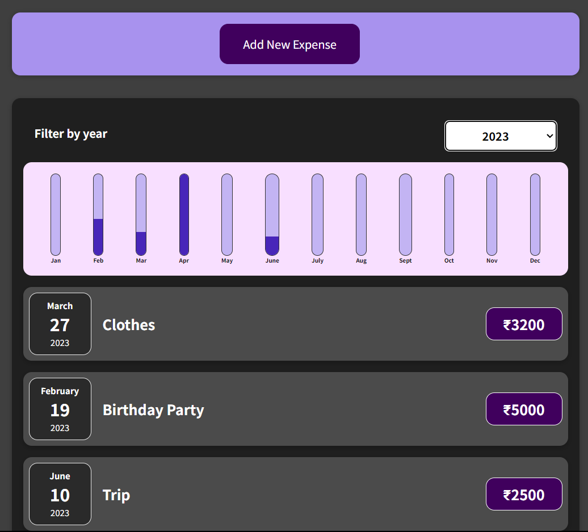

# Expense Tracker made by Nitin Singh

## Table of Contents
- [Description](#description)
- [Features](#features)
- [Installation](#installation)
- [Contributing](#contributing)

## Description
The Expense Tracker is a web application that helps users keep track of their expenses and manage their budget effectively. It is built using HTML, CSS, and JavaScript, and it provides a simple and intuitive interface to add, view, and categorize expenses.

## Features
- Add new expenses with details like date, description, amount, and category.
- View a summary of expenses for a specific date range.
- Categorize expenses for better organization and analysis.
- Edit or delete existing expenses.
- Visual representation of expenses using charts or graphs (optional).

## Installation
To use the expense tracker locally, follow these steps:
1. Clone or download this repository to your local machine.
2. Navigate to the project directory.

## Contributing
Contributions are welcome! If you find any issues or have suggestions for improvements, feel free to open an issue or create a pull request.
